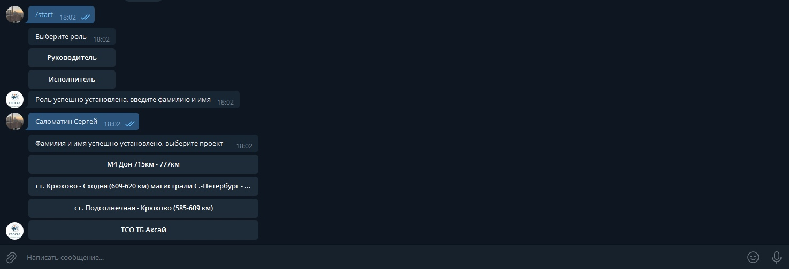
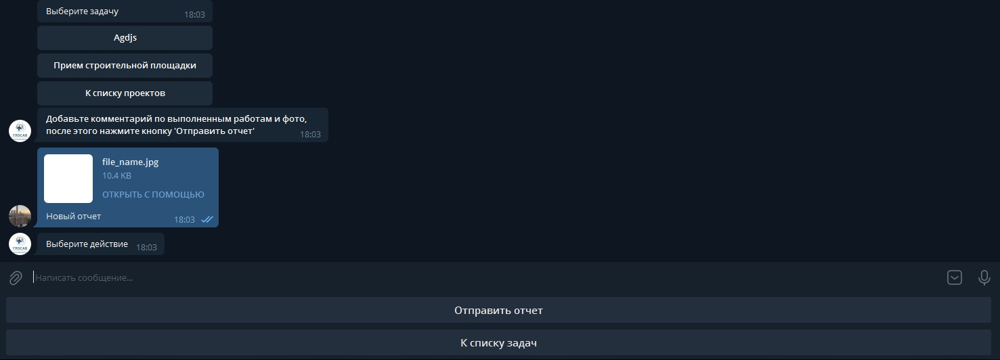
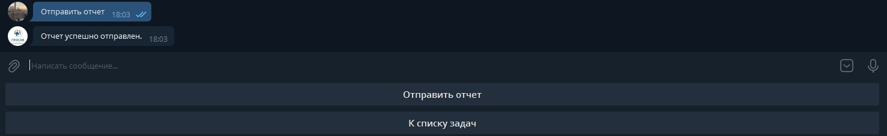
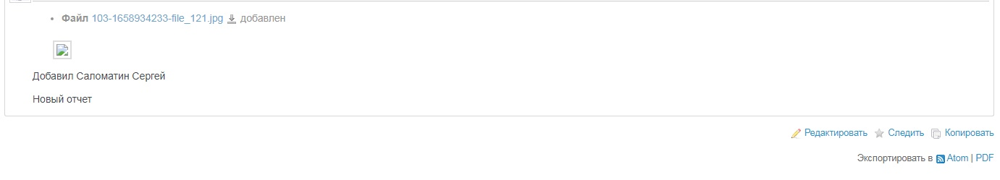

# Redmine Telegram Bot

## Functional
* Role
* Projects
* Issues
* Send notice in redmine
* Send notice to the lead

## Settings

### 1. Restore DB database/db.sql (MySQL)

### 2. Set Webhook
```php
https://api.telegram.org/bot<Token>/setWebhook?url=https://<Path bot.php>
```
### 3. Customize file include/config.php
```php
<?php
return [

    // Database
    'host' => '', // DB host
    'dbName' => '', // DB name
    'userName' => '', // DB user name
    'password' => '', // DB password
    'charset' => 'utf8',

    // Telegram
    'tgToken' => '', // Bot father token
    'tgApiUrl' => 'https://api.telegram.org/bot',

    // Redmine
    'rdToken' => '', // RedMine API Key
    'rdUrl' => '', // http://195.208.25.161:33081/redmine/

    // other
    'sendPath' => '' // https://<Domen>/redmine_tg/redmine_send_notice.php?chat_id=
];
?>
```

## Preview

### Start


### Work with issue


### Send notice in redmine



